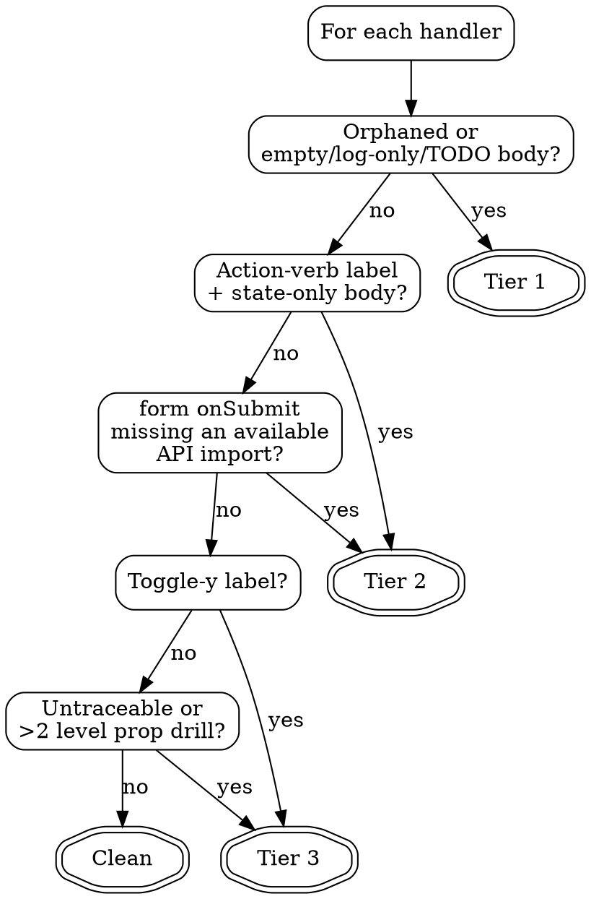

# UI-Finisher Implementation Plan

> **For agentic workers:** REQUIRED SUB-SKILL: Use superpowers:subagent-driven-development (recommended) or superpowers:executing-plans to implement this plan task-by-task. Steps use checkbox (`- [ ]`) syntax for tracking.

**Goal:** Build the `ui-finisher` plugin with a single `audit-ui-handlers` skill that audits frontend source files for unfinished interactive elements, proposes gated patches, and emits a manual QA checklist.

**Architecture:** LLM-native static analysis. Claude uses Read/Grep/Edit with its native code comprehension — no custom parsers or AST libraries. The skill runs a five-phase pipeline (Harvest → Trace → Classify → Propose → Approve & Patch) with two rigid gates: no writes before user approval, and no repo-wide grep beyond direct file imports. Coordination pattern: Generator-Verifier with the user as verifier.

**Tech Stack:** Markdown (SKILL.md), JSON (plugin.json), plus fixture JSX/TSX files for baseline testing. No runtime dependencies.

**Reference spec:** `docs/specs/2026-04-11-ui-finisher-design.md`

---

## File Structure

Files this plan creates:

```
plugins/ui-finisher/
├── .claude-plugin/
│   └── plugin.json                 # name, description, version (0.1.0)
├── skills/
│   └── audit-ui-handlers/
│       ├── SKILL.md                # frontmatter + five-phase pipeline + gates
│       ├── tiering-rules.md        # detailed tier classification heuristics
│       └── report-template.md      # exact report + QA checklist format
└── CHANGELOG.md                    # Keep a Changelog, 0.1.0 entry

docs/plans/2026-04-11-ui-finisher.md  # this plan (already exists)
```

Test fixture files (temporary, not committed with the plugin):

```
/tmp/ui-finisher-baseline/
├── SettingsForm.tsx                # mixed Tier 1/2/3 handlers for baseline test
└── expected-findings.md            # what the skill should produce
```

Responsibility boundaries:
- **plugin.json** — plugin metadata only
- **SKILL.md** — the pipeline, gates, red flags, rationalizations, verification checklist. Scan-optimized, ~1000 words.
- **tiering-rules.md** — heavy reference for tier classification. Keeps SKILL.md light.
- **report-template.md** — the exact report + checklist format. Keeps SKILL.md light.
- **CHANGELOG.md** — version history only.

---

## Task 1: Scaffold Plugin Directory

**Files:**
- Create: `plugins/ui-finisher/.claude-plugin/plugin.json`
- Create: `plugins/ui-finisher/skills/audit-ui-handlers/SKILL.md` (placeholder only)
- Create: `plugins/ui-finisher/CHANGELOG.md`

- [ ] **Step 1: Create plugin.json**

Create `plugins/ui-finisher/.claude-plugin/plugin.json`:

```json
{
  "name": "ui-finisher",
  "description": "Audit frontend source files for unfinished interactive elements — orphaned buttons, stubbed handlers, missing side effects — and propose patches with human approval",
  "version": "0.1.0"
}
```

- [ ] **Step 2: Create CHANGELOG.md**

Create `plugins/ui-finisher/CHANGELOG.md`:

```markdown
# Changelog

All notable changes to the `ui-finisher` plugin are documented in this file.

The format is based on [Keep a Changelog](https://keepachangelog.com/en/1.1.0/),
and this plugin adheres to [Semantic Versioning](https://semver.org/spec/v2.0.0.html).

## [0.1.0] - 2026-04-11

### Added

- `audit-ui-handlers` skill: five-phase audit pipeline (Harvest → Trace → Classify → Propose → Approve & Patch) for finding unfinished interactive elements in frontend source files
- `tiering-rules.md` supporting file with detailed tier classification heuristics
- `report-template.md` supporting file with exact report and QA checklist format
- Two rigid gates: no writes before user approval, no repo-wide grep beyond direct file imports
```

- [ ] **Step 3: Create SKILL.md placeholder**

Create `plugins/ui-finisher/skills/audit-ui-handlers/SKILL.md` with minimal frontmatter so validation can run:

```markdown
---
name: audit-ui-handlers
description: Use when auditing a frontend source file or route for unfinished interactive elements — orphaned buttons, stubbed handlers, or handlers missing required side effects like API calls or state updates
---

# Audit UI Handlers

Placeholder — content added in Task 5.
```

- [ ] **Step 4: Run the validator to confirm scaffold shape**

Run: `bin/validate-plugin plugins/ui-finisher`
Expected: validator reports structural errors are absent (may still warn about placeholder content — that's fine for this step). Record any unexpected errors.

- [ ] **Step 5: Commit the scaffold**

```bash
git add plugins/ui-finisher/.claude-plugin/plugin.json plugins/ui-finisher/skills/audit-ui-handlers/SKILL.md plugins/ui-finisher/CHANGELOG.md
git commit -m "chore(ui-finisher): scaffold plugin directory"
```

---

## Task 2: Create Baseline Test Fixture

**Files:**
- Create: `/tmp/ui-finisher-baseline/SettingsForm.tsx`
- Create: `/tmp/ui-finisher-baseline/expected-findings.md`

The baseline test needs a fixture file with handlers seeded in each tier. This is not committed to the repo — it's a temporary fixture for the RED/GREEN test cycle.

- [ ] **Step 1: Create the fixture file**

Create `/tmp/ui-finisher-baseline/SettingsForm.tsx` with exactly this content:

```tsx
import { updateUser, deleteUser } from './api/users';
import { toast } from 'react-hot-toast';
import { useState } from 'react';

export function SettingsForm({ userId }: { userId: string }) {
  const [name, setName] = useState('');
  const [email, setEmail] = useState('');
  const [isOpen, setIsOpen] = useState(false);

  // TIER 1: orphaned button, no onClick prop at all
  // Expected: Tier 1, proposal wires handleDelete using deleteUser
  const deleteButton = <button>Delete Account</button>;

  // TIER 1: handler body is only console.log
  // Expected: Tier 1, proposal replaces with updateUser + toast
  const handleSave = () => {
    console.log('saved');
  };

  // TIER 2: form onSubmit only updates state; button labeled "Save Settings"
  // Expected: Tier 2, proposal calls updateUser (already imported)
  const handleFormSubmit = (e: React.FormEvent) => {
    e.preventDefault();
    setName(name.trim());
    setEmail(email.trim());
  };

  // TIER 3: toggle-y label + local state only
  // Expected: Tier 3, flagged but no proposal
  const handleToggleMenu = () => {
    setIsOpen(v => !v);
  };

  // CLEAN: fully traced, calls real API
  // Expected: not touched
  const handleRefresh = async () => {
    try {
      await updateUser(userId, { name, email });
      toast.success('refreshed');
    } catch (err) {
      toast.error('failed');
    }
  };

  return (
    <div>
      {deleteButton}
      <button onClick={handleSave}>Save</button>
      <form onSubmit={handleFormSubmit}>
        <input value={name} onChange={e => setName(e.target.value)} />
        <input value={email} onChange={e => setEmail(e.target.value)} />
        <button type="submit">Save Settings</button>
      </form>
      <button onClick={handleToggleMenu}>Toggle Filters</button>
      <button onClick={handleRefresh}>Refresh</button>
      <a href="/help">Help</a>
    </div>
  );
}
```

- [ ] **Step 2: Create the expected findings file**

Create `/tmp/ui-finisher-baseline/expected-findings.md`:

```markdown
# Expected Findings for SettingsForm.tsx

## Tier 1 (will propose diffs)
- `<button>Delete Account</button>` — orphaned, no onClick. Proposal should wire handleDelete that calls deleteUser(userId).
- `handleSave` — body is only console.log. Proposal should call updateUser(userId, {name, email}) inside try/catch with toast.

## Tier 2 (will propose diffs)
- `handleFormSubmit` — state-only updates, button labeled "Save Settings". Proposal should call updateUser since it's already imported.

## Tier 3 (flagged, no proposal)
- `handleToggleMenu` — toggle-y label, local state only. Note: left as-is.

## Clean (not touched)
- `handleRefresh` — fully traced, calls updateUser with try/catch.
- `<a href="/help">Help</a>` — static link.
- `<input>` elements — controlled inputs, complete.

## Gates to verify
- No Edit call before user approves
- No Grep outside the target file or its direct imports
```

- [ ] **Step 3: No commit**

This fixture is temporary — `/tmp` is not part of the repo. Move on to Task 3.

---

## Task 3: Run Baseline Test (RED)

This is the failing baseline test. Before writing the skill content, run Claude (mentally or via a subagent) against the fixture **without** the SKILL.md content available, and record the failures.

- [ ] **Step 1: Dispatch a subagent to audit the fixture without the skill**

Use the Task tool with `subagent_type: general-purpose` and prompt:

> Read `/tmp/ui-finisher-baseline/SettingsForm.tsx` and produce an audit report listing every interactive element, whether its handler is "finished" or "unfinished", and what you would do to fix each unfinished one. Do not use any skill — just reason from the code. Output your answer as a markdown report.

Record the subagent's output.

- [ ] **Step 2: Compare against expected findings**

For each expected finding in `/tmp/ui-finisher-baseline/expected-findings.md`, note whether the subagent:
- Correctly identified the tier
- Proposed reasonable code using only in-file imports
- Refrained from writing files
- Refrained from grepping the whole repo

Expected to FAIL on at least these points (the baseline test's whole purpose):
- Tier boundaries are fuzzy without the rules
- May propose code using imports that don't exist (hallucination)
- May attempt to write files without asking
- May grep wider than the target file

- [ ] **Step 3: Record RED results**

Save the subagent output and comparison notes to `/tmp/ui-finisher-baseline/red-results.md`. These become the rationalizations the SKILL.md must close in later tasks.

- [ ] **Step 4: No commit**

RED results are not committed. They inform Task 5's content.

---

## Task 4: Write Supporting File — `tiering-rules.md`

**Files:**
- Create: `plugins/ui-finisher/skills/audit-ui-handlers/tiering-rules.md`

This file contains the full tier classification rules with examples. SKILL.md will reference it by name.

- [ ] **Step 1: Write tiering-rules.md**

Create `plugins/ui-finisher/skills/audit-ui-handlers/tiering-rules.md`:

```markdown
# Tiering Rules

Detailed tier classification heuristics for `audit-ui-handlers`. SKILL.md references this file by name for scan-time lookup.

## Tier Definitions

### Tier 1 — Definitely Unfinished

Propose a diff. Confidence: high.

An element or handler is Tier 1 if ANY of these apply:

1. **Orphaned element** — an interactive element (`button`, `a`, custom `*Button`, `*Link`, etc.) has no interaction prop (`onClick`, `onSubmit`, `onChange`, `href`) and is not inside a `<form>` with its own `onSubmit` when `type="submit"` would apply.
2. **Empty body** — handler is literally `() => {}` or `function() {}` with no statements.
3. **Log-only body** — handler contains only `console.log(...)`, `console.warn(...)`, `console.error(...)`, or `alert(...)` and nothing else.
4. **TODO comment** — handler contains a comment matching `/stub|placeholder|not\s+implemented|fixme|todo/i` as its only substantive content.

### Tier 2 — Likely Unfinished

Propose a diff. Confidence: medium. Include a `Rationale` field explaining the signal.

An element or handler is Tier 2 if ANY of these apply:

1. **Action-verb label + state-only handler** — button text matches `/save|submit|delete|create|update|send|publish|confirm/i` AND the handler contains only `setState`/`useState` setter calls (no network call, no side effect).
2. **Form onSubmit missing an available API** — a `<form onSubmit={handler}>` where `handler` doesn't reference any function imported from `api/*`, `services/*`, `lib/api/*`, or `graphql/*`, AND such imports exist in the target file.
3. **One-level indirection into a Tier 1 body** — handler calls a named function that itself matches Tier 1.

### Tier 3 — Ambiguous

Flag only. No proposal. Include a `Note` field explaining why no proposal.

An element or handler is Tier 3 if ANY of these apply:

1. **Toggle-y label** — button text matches `/toggle|show|hide|close|open|menu|expand|collapse|filter/i` AND handler is state-only. Likely correct as-is.
2. **Untraceable handler** — handler is prop-drilled from a parent and exceeds the 2-level trace depth cap.
3. **Unknown callee** — handler calls a function that isn't defined in the target file and isn't imported with a traceable source.

### Clean

Do not touch. Do not report (except in the optional "not touching" summary list).

- Handler is fully traced within the 2-level cap
- Handler performs a non-trivial side effect (network call, store dispatch, navigation, etc.) OR an expected local-only operation for a toggle-y label

## Downgrade Rule

If a Tier 1 or Tier 2 finding has NO usable imports in the target file to build a proposal from, downgrade it to Tier 3 with this note:

> `Note: no in-file imports match the expected side effect. Could look wider for context; re-run after widening scope.`

This is the only way Tier 3 findings escape the strict imports-only scope. The skill still does not grep outside the target file.

## Examples

### Tier 1 — orphaned button

```tsx
<button>Delete Account</button>
```
Result: Tier 1. No onClick, no `type="submit"`. Propose `onClick={handleDelete}` and a `handleDelete` function body using any imported delete function.

### Tier 1 — log-only body

```tsx
const handleSave = () => { console.log('saved'); };
```
Result: Tier 1. Body is only a log. Propose a replacement using imported mutations and toast utilities.

### Tier 2 — state-only with action label

```tsx
const handleSubmit = (e) => {
  e.preventDefault();
  setForm(f => ({ ...f, saved: true }));
};
// button: <button type="submit">Save Settings</button>
```
Result: Tier 2. Label is an action verb; handler only updates state. If `updateUser` is imported, propose wrapping state update with a real call.

### Tier 3 — toggle label

```tsx
const toggleMenu = () => setOpen(v => !v);
// button: <button onClick={toggleMenu}>Toggle Filters</button>
```
Result: Tier 3. Toggle-y label + state-only handler = matches local UI mutation pattern. Flag, don't propose.

### Tier 3 — untraceable

```tsx
export function UserRow({ onDelete }: { onDelete: () => void }) {
  return <button onClick={onDelete}>Delete</button>;
}
```
Result: Tier 3 if `onDelete` is prop-drilled from a grandparent. Note the trace depth and stop.

### Clean — real side effect

```tsx
const handleRefresh = async () => {
  try { await updateUser(id, body); toast.success('ok'); }
  catch (e) { toast.error('fail'); }
};
```
Result: Clean. Do not touch.
```

- [ ] **Step 2: Commit the supporting file**

```bash
git add plugins/ui-finisher/skills/audit-ui-handlers/tiering-rules.md
git commit -m "feat(ui-finisher): add tiering-rules supporting file"
```

---

## Task 5: Write Supporting File — `report-template.md`

**Files:**
- Create: `plugins/ui-finisher/skills/audit-ui-handlers/report-template.md`

This file holds the exact report and QA checklist format so SKILL.md can reference it without inlining.

- [ ] **Step 1: Write report-template.md**

Create `plugins/ui-finisher/skills/audit-ui-handlers/report-template.md`:

````markdown
# Report Template

Exact output format for `audit-ui-handlers`. SKILL.md references this file by name.

## Audit Report Format

After Phase 4 completes (but BEFORE any write), emit exactly this shape:

```
UI-Finisher Audit: <target-file-path>

[Tier 1 — will propose diffs]
  <N>. <element-description or handler name>  (line <line>)
     Issue: <one-line description of what is unfinished>
     Proposal: <one-line summary of the planned patch>
     Confidence: high

[Tier 2 — will propose diffs]
  <N>. <element-description or handler name>  (line <line>)
     Issue: <one-line description>
     Proposal: <one-line summary>
     Confidence: medium
     Rationale: <why this qualifies as Tier 2>

[Tier 3 — flagged, no proposal]
  <N>. <element-description or handler name>  (line <line>)
     Status: <why the skill is not acting>
     Note: <optional "could look wider" text if downgraded>

[Clean — not touching]
  - <element description> (line <line>)
  - <element description> (line <line>)
```

Omit any section that has no entries. Numbering restarts at 1 within each tier. Every proposal MUST also have a corresponding unified diff held in memory — the one-line summary is just the report view.

## Approval Prompt Format

Immediately after the report:

```
Proposals: <count> (<comma-separated proposal numbers>). Apply which?
  a) all
  b) pick (e.g., "1,3")
  c) none
```

Wait for a response. The default — and the response to anything ambiguous — is "none".

## QA Checklist Format

AFTER successful Edit calls, emit:

```
Manual QA Checklist for <target-file-path>:

[ ] <human action> — verify <observable outcome>
[ ] <human action> — verify:
    - <sub-check 1>
    - <sub-check 2>
    - <sub-check 3>
```

Rules:
- One checkbox per patched handler (Tier 1 + Tier 2 that the user accepted)
- Each checkbox begins with a concrete human action ("Click X", "Fill Y and submit", "Navigate to Z")
- Each checkbox ends with an observable outcome the human can verify
- Multi-step handlers get sub-check bullets (loading state, success toast, error toast, etc.)
- Do not include checklist items for Tier 3 or Clean findings

## Error Output

If any Edit fails during Phase 5:

```
UI-Finisher: Edit failed on proposal <N>. Stopping.
  Reason: <error message>
  Remaining proposals not applied: <list of numbers>
```

Do not auto-recover. Do not continue applying subsequent proposals after a failure.
````

- [ ] **Step 2: Commit the supporting file**

```bash
git add plugins/ui-finisher/skills/audit-ui-handlers/report-template.md
git commit -m "feat(ui-finisher): add report-template supporting file"
```

---

## Task 6: Write SKILL.md Content (GREEN)

**Files:**
- Modify: `plugins/ui-finisher/skills/audit-ui-handlers/SKILL.md`

Replace the placeholder with the full skill content. This is the GREEN phase of the TDD cycle — it must close the rationalizations recorded in `/tmp/ui-finisher-baseline/red-results.md`.

- [ ] **Step 1: Replace SKILL.md content**

Overwrite `plugins/ui-finisher/skills/audit-ui-handlers/SKILL.md` with exactly this content:

````markdown
---
name: audit-ui-handlers
description: Use when auditing a frontend source file or route for unfinished interactive elements — orphaned buttons, stubbed handlers, or handlers missing required side effects like API calls or state updates
---

# Audit UI Handlers

Audit a single frontend source file for unfinished interactive elements — orphaned buttons, stubbed handlers, handlers missing required side effects — and propose patches gated by human approval.

Violating the letter of the rules is violating the spirit of the rules.

## When to Use

- Auditing a single component, page, or route for unfinished UI wiring
- User says "is this form done?", "did I wire up the delete button?", "check this page for stubs"
- Reviewing a file you suspect has `console.log` handlers or empty callbacks
- Before merging a feature branch where UI shells were scaffolded first

## When NOT to Use

- Auditing an entire project (this skill runs on one file at a time)
- Running tests or headless browser checks (this is static analysis)
- Generating new components from scratch (use a scaffolding skill)
- Refactoring UI style or layout (use design skills)
- The file has no interactive elements (buttons, forms, inputs, links)

## Rigid Gates

```
NO EDIT CALL BEFORE EXPLICIT USER APPROVAL OF THE PROPOSAL LIST.
NO GREP OUTSIDE THE TARGET FILE AND ITS DIRECT IMPORTS.
```

Both gates are rigid. Violating either means the skill has failed regardless of what was produced.

## Checklist

You MUST create a task for each of these items and complete them in order:

1. **Phase 1 — Harvest** interactive elements from the target file
2. **Phase 2 — Trace** each handler to its definition (cap at 2 levels)
3. **Phase 3 — Classify** each finding into Tier 1, Tier 2, Tier 3, or Clean
4. **Phase 4 — Propose** diffs for Tier 1 and Tier 2 only
5. **Phase 5a — Present** the full report and approval prompt
6. **Phase 5b — Approve** — wait for the user's explicit answer
7. **Phase 5c — Patch** each accepted proposal via Edit, stop on first failure
8. **Phase 5d — Checklist** — emit the manual QA checklist only after successful patches

## Phase 1: Harvest

Read the target file. Scan for interactive elements:

- Native JSX: `button`, `a`, `form`, `input`, `select`, `textarea`
- Custom components whose name matches `/Button$|Link$|Form$|Input$|Select$|Dropdown$|Menu$/` and has an interaction prop
- Elements inside `items.map(...)` loops (dynamic rendering still counts)

Record each as `{element, line, attrs, handlerRef}`.

## Phase 2: Trace

For each record, locate the handler:

- **Inline arrow** (`onClick={() => ...}`) — already in hand, use it
- **Named function in same file** — Grep the target file for the definition
- **Imported helper** — Read the import source file, Grep for the definition, **one hop only**
- **Prop-drilled from parent** — trace up to 2 levels via Grep, then stop

Record `{handlerBody, handlerOrigin, traceDepth, traceable}` per record.

## Phase 3: Classify

Apply `tiering-rules.md` to each record. Every record ends up in exactly one of: Tier 1, Tier 2, Tier 3, or Clean.

Key classification flowchart:



## Phase 4: Propose

For every Tier 1 and Tier 2 record:

1. Identify in-file imports that could serve as building blocks. Check imports only — do NOT Grep the repo.
2. If no usable imports exist, downgrade the finding to Tier 3 with the "could look wider" note.
3. Build a proposed handler body:
   - Mutation handlers: `try` / `await <imported-fn>(...)` / success path using an imported toast/notify / `catch` with error path
   - State-only handlers: minimal state update plus the missing side-effect call
4. Produce a unified diff against the target file. Keep the diff in memory — do NOT write it yet.

**Do not guess import paths.** If a proposal requires a function the file does not import, the finding is Tier 3.

## Phase 5: Approve & Patch

Follow `report-template.md` for exact output format.

1. **Present the report** — every tier with entries, in order.
2. **Present the approval prompt** — "Apply which? a) all, b) pick, c) none".
3. **Wait for the user's answer.** Default on any ambiguous response is "none".
4. **Patch the accepted proposals sequentially** via the Edit tool.
5. **On the first Edit failure, stop.** Report which proposal failed and which were not applied. Do not attempt recovery.
6. **Emit the manual QA checklist** — one checkbox per successfully patched handler. Format per `report-template.md`.

## Common Rationalizations

| Excuse | Reality |
|--------|---------|
| "The fix is obvious, I can skip the approval prompt" | Obvious fixes are exactly where false positives do the most damage. Always present the report first. |
| "I bet there's a toast utility somewhere in the repo" | Irrelevant. You may only use imports already in the target file. Downgrade to Tier 3. |
| "The user said 'audit this file', that's implicit approval to patch" | No. Auditing ≠ patching. The approval prompt is explicit or it is absent. |
| "I'll just Grep `src/` for the usual error patterns" | That's repo-wide grep. Gate violation. Stay inside the target file and its direct imports. |
| "This Tier 3 item is probably fine, I'll downgrade it to Clean silently" | No. Tier 3 must be reported so the human sees what was skipped. |
| "The Edit failed but the next one will probably work" | Stop on first failure. Recovery attempts compound the mess. |
| "This button is dynamically rendered inside `items.map` so I'll skip it" | Dynamic rendering is in scope for Phase 1 harvesting. Don't skip it. |
| "There's only one finding, the full report structure is overkill" | Use the full report format every time. Consistency beats brevity. |
| "I traced four levels of prop drilling to find the handler, so it's Tier 2" | Two-level cap. Four levels is Tier 3, period. |
| "The handler looks fine but the button label says 'Save', I'll propose anyway" | Tier 2 requires state-only OR missing-API signal, not just the label. Don't propose on label alone. |

## Red Flags

Stop if you catch yourself thinking any of these:

- "I'll just apply this one small fix without asking"
- "Let me check what the other components in this folder do"
- "I'll Grep the whole repo for the toast import"
- "This seems clear enough that I can skip the report"
- "The user will want this patched, I'll handle approval implicitly"
- "I'll read three more files to figure out the missing context"
- "Let me guess the API call signature"
- "I'll collapse Tier 3 findings into the Clean list to keep the report short"
- "After the first Edit fails I'll try the next one"
- "This is just a quick audit, I don't need the full pipeline"

## Verification Checklist

Run at the end of every invocation:

- [ ] Harvest covered every interactive element in the file, including `items.map(...)` loops
- [ ] Trace depth never exceeded 2 levels for any handler
- [ ] No Grep call targeted a path outside the target file and its direct imports
- [ ] Every proposal used only imports already present in the target file
- [ ] The full structured report was emitted before any Edit call
- [ ] The approval prompt was shown and an explicit answer was received
- [ ] Edit was called zero times if the user answered "none"
- [ ] On Edit failure, the skill stopped instead of retrying
- [ ] The QA checklist was emitted only after successful Edit calls
- [ ] Tier 3 findings appear in the report, not hidden in Clean

## Supporting Files

- `tiering-rules.md` — detailed tier classification heuristics and downgrade rule
- `report-template.md` — exact report, approval prompt, and QA checklist formats

## Real-World Example

Target: `src/components/SettingsForm.tsx`. Imports include `updateUser`, `deleteUser`, and `toast`.

Phase 1–3 find five records:

1. `<button>Delete Account</button>` — orphaned → Tier 1
2. `handleSave` — body is `console.log('saved')` → Tier 1
3. `<form onSubmit={handleFormSubmit}>` — handler only calls `setState`; button labeled "Save Settings" → Tier 2
4. `<button>Toggle Filters</button>` — handler `setOpen(v => !v)`, toggle-y label → Tier 3
5. `handleRefresh` — try/catch around `updateUser` + toast → Clean

Phase 4 proposes two Tier 1 diffs and one Tier 2 diff, all using `updateUser`, `deleteUser`, and `toast` (already imported). Phase 5 emits the report, user answers "all", skill applies three edits, then emits the QA checklist with three items.
````

- [ ] **Step 2: Commit the skill content**

```bash
git add plugins/ui-finisher/skills/audit-ui-handlers/SKILL.md
git commit -m "feat(ui-finisher): add audit-ui-handlers skill content"
```

---

## Task 7: Run Baseline Test (GREEN)

Re-run the baseline audit against the fixture, this time WITH the skill loaded. The skill must close every rationalization recorded in RED.

- [ ] **Step 1: Dispatch a subagent to audit the fixture with the skill**

Use the Task tool with `subagent_type: general-purpose` and prompt:

> Use the `audit-ui-handlers` skill (plugins/ui-finisher/skills/audit-ui-handlers/SKILL.md and its supporting files tiering-rules.md and report-template.md in the same directory) to audit `/tmp/ui-finisher-baseline/SettingsForm.tsx`. Follow the skill exactly: emit the full report using the report template, then stop at the approval prompt — do not call Edit. Output the full report text and a note confirming no Edit was attempted.

Record the subagent's output.

- [ ] **Step 2: Verify each expected finding is correctly classified**

Compare the subagent output to `/tmp/ui-finisher-baseline/expected-findings.md`. Every item must match:

- Tier 1: `Delete Account` button and `handleSave` both appear in the Tier 1 section
- Tier 2: `handleFormSubmit` appears in the Tier 2 section with a Rationale line
- Tier 3: `handleToggleMenu` appears in the Tier 3 section with a Note
- Clean: `handleRefresh`, the help link, and the inputs appear in the Clean section (or are omitted entirely, which is also acceptable)

- [ ] **Step 3: Verify rigid gates**

The subagent's output must show:

- The full report was emitted
- The approval prompt was emitted
- No Edit tool call was made (the subagent explicitly confirms this)
- No Grep of paths outside `/tmp/ui-finisher-baseline/` was made

If any gate was violated, the RED rationalizations are not closed — return to Task 6 and strengthen the Red Flags / Rationalizations tables.

- [ ] **Step 4: Record GREEN results**

Save the subagent output to `/tmp/ui-finisher-baseline/green-results.md`. No commit.

---

## Task 8: Refactor — Close Any Remaining Loopholes

- [ ] **Step 1: Diff RED vs GREEN**

Compare `/tmp/ui-finisher-baseline/red-results.md` against `/tmp/ui-finisher-baseline/green-results.md`. For any RED failure that is NOT closed in GREEN, identify the loophole.

- [ ] **Step 2: Strengthen SKILL.md if needed**

If any loophole remains:

1. Add a new row to the Common Rationalizations table in SKILL.md targeting the exact excuse
2. Add the matching Red Flag thought
3. Commit the strengthening change:

```bash
git add plugins/ui-finisher/skills/audit-ui-handlers/SKILL.md
git commit -m "refactor(ui-finisher): close baseline loophole — <short description>"
```

4. Re-run Task 7 against the updated skill

If GREEN is clean on the first pass, no changes needed. Record "no loopholes found" in `/tmp/ui-finisher-baseline/green-results.md` and move on.

---

## Task 9: Run the Plugin Validator

- [ ] **Step 1: Run bin/validate-plugin**

Run: `bin/validate-plugin plugins/ui-finisher`
Expected: zero errors. Warnings are acceptable if they are informational (e.g., word count notes).

- [ ] **Step 2: Fix any errors**

If the validator reports errors, fix them inline in SKILL.md, plugin.json, or CHANGELOG.md. Re-run until clean. Commit fixes:

```bash
git add plugins/ui-finisher/
git commit -m "fix(ui-finisher): address validator errors"
```

- [ ] **Step 3: Verify no @ links or path references**

Run: `grep -n '@\|\.\./\|/plugins/\|/skills/\|/references/' plugins/ui-finisher/skills/audit-ui-handlers/SKILL.md || echo OK`

Expected: `OK` (no forbidden references). If grep returns matches, remove them — reference by skill name only.

---

## Task 10: Quality Gate Checklist

Confirm every item in the quality gate from `sft-build-plugin`:

- [ ] **Step 1: Confirm description format**

Read the SKILL.md frontmatter. Description MUST start with "Use when" and contain triggering conditions only (no workflow summary).

- [ ] **Step 2: Confirm type-required sections exist**

`audit-ui-handlers` is a Technique with rigid gates. Required sections:
- When to Use / When NOT to Use — present
- Rigid Gates (Iron Law style, in code block) — present
- Checklist with numbered steps — present
- Phases 1–5 — present
- Common Rationalizations table — present
- Red Flags list — present
- Verification Checklist — present

- [ ] **Step 3: Confirm supporting files exist and are referenced**

- `tiering-rules.md` exists and is referenced by name in SKILL.md — yes
- `report-template.md` exists and is referenced by name in SKILL.md — yes

- [ ] **Step 4: Confirm no @ links or path references**

Already checked in Task 9, Step 3.

- [ ] **Step 5: Confirm word count**

Run: `wc -w plugins/ui-finisher/skills/audit-ui-handlers/SKILL.md`
Expected: roughly 900–1200 words. Technique skills with gates run ~1000 words.

- [ ] **Step 6: Confirm validator passes**

Already ran in Task 9. Re-run if anything changed:
`bin/validate-plugin plugins/ui-finisher`
Expected: zero errors.

- [ ] **Step 7: Confirm baseline test is documented**

`/tmp/ui-finisher-baseline/red-results.md` and `/tmp/ui-finisher-baseline/green-results.md` exist and the GREEN file shows all expected findings matched. No commit — baseline results are session-local.

If any quality gate item fails, fix it and re-run this task.

---

## Task 11: Final Commit and Handoff

- [ ] **Step 1: Confirm working tree**

Run: `git status`
Expected: clean working tree. No uncommitted plugin files.

- [ ] **Step 2: Show the final plugin**

Run: `find plugins/ui-finisher -type f | sort`

Expected output:

```
plugins/ui-finisher/.claude-plugin/plugin.json
plugins/ui-finisher/CHANGELOG.md
plugins/ui-finisher/skills/audit-ui-handlers/SKILL.md
plugins/ui-finisher/skills/audit-ui-handlers/report-template.md
plugins/ui-finisher/skills/audit-ui-handlers/tiering-rules.md
```

- [ ] **Step 3: Show commit log for the plugin**

Run: `git log --oneline -- plugins/ui-finisher`

Expected: the commits from Tasks 1, 4, 5, 6, possibly 8, and 9, in chronological order.

The plugin is implementation-complete. The build-plugin orchestrator handles versioning (already at 0.1.0) and the finishing-a-development-branch handoff.

---

## Self-Review Notes

- **Spec coverage:** every section of `docs/specs/2026-04-11-ui-finisher-design.md` is covered — Overview (Task 6 SKILL.md), Scope (Task 6 When to Use), Pipeline phases 1–5 (Task 6 phase sections), Report format (Task 5 + Task 6 references), Skill structure (Task 6 sections), Plugin packaging (Tasks 1, 4, 5, 6), Validation strategy (Tasks 2, 3, 7, 8), Blind spots (Task 6 rationalizations).
- **Placeholder scan:** no TBD/TODO. Every code block is complete.
- **Type consistency:** file paths, skill name, supporting file names, and section names are consistent across all tasks. `audit-ui-handlers` is always the skill directory name; `tiering-rules.md` and `report-template.md` are always referenced by exact filename.
