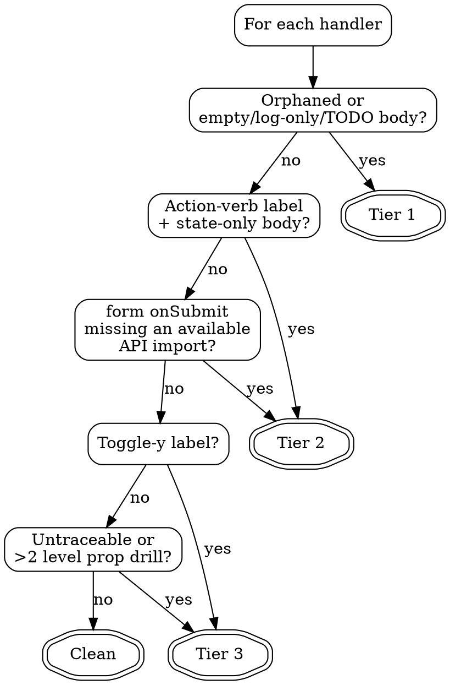

# Audit UI Handlers

Audit a single page — identified by its URL (e.g., `/dashboard`) or, if preferred, a direct file path — for unfinished interactive elements: orphaned buttons, stubbed handlers, handlers missing required side effects. Propose patches gated by human approval. Static analysis only — the skill never fetches the URL.

Violating the letter of the rules is violating the spirit of the rules.

## When to Use

- Auditing a single page by its URL or route (e.g., `/dashboard`, `/settings/profile`, `/account`) for unfinished UI wiring
- User says "is /dashboard done?", "did I wire up the delete button on /account?", "check /settings for stubs"
- You already have the file path and want to skip URL resolution — pass the file directly
- Reviewing a page you suspect has `console.log` handlers or empty callbacks
- Before merging a feature branch where UI shells were scaffolded first

## When NOT to Use

- Auditing an entire site or flow (this skill runs on one page at a time)
- Running the live app, hitting the URL, or doing any network fetch — this is pure static analysis
- Generating new components from scratch (use a scaffolding skill)
- Refactoring UI style or layout (use design skills)
- The page has no interactive elements (buttons, forms, inputs, links)
- A URL you cannot resolve to a file on disk even with the Phase 0 rules — ask the user for a file path instead of guessing

## Rigid Gates

```
NO EDIT CALL BEFORE EXPLICIT USER APPROVAL OF THE PROPOSAL LIST.
NO GREP OUTSIDE THE TARGET FILE AND ITS DIRECT IMPORTS DURING PHASES 1–5.
```

Both gates are rigid. Violating either means the skill has failed regardless of what was produced.

Phase 0 (URL → file resolution) runs before the target file exists and has its own narrow allowance: at most one Grep, bounded to conventional route-registration files. See Phase 0 below. Any Grep outside that narrow allowance — during Phase 0 or any later phase — is a gate violation.

## Checklist

You MUST create a task for each of these items and complete them in order:

1. **Phase 0 — Resolve** the input to a target file (URL/route → file, or accept a direct file path)
2. **Phase 1 — Harvest** interactive elements from the target file
3. **Phase 2 — Trace** each handler to its definition (cap at 2 levels)
4. **Phase 3 — Classify** each finding into Tier 1, Tier 2, Tier 3, or Clean
5. **Phase 4 — Propose** diffs for Tier 1 and Tier 2 only
6. **Phase 5a — Present** the full report and approval prompt
7. **Phase 5b — Approve** — wait for the user's explicit answer
8. **Phase 5c — Patch** each accepted proposal via Edit, stop on first failure
9. **Phase 5d — Checklist** — emit the manual QA checklist only after successful patches

## Phase 0: Resolve

Translate the user's input into a single **target file** on disk. If the user already gave you an absolute or workspace-relative file path, skip this phase entirely and move to Phase 1.

**Static-analysis discipline:** Never fetch the URL. Never run the app. Never start a headless browser. If the input is a full URL (`https://example.com/settings`), discard the origin and keep only the path (`/settings`). Treat query strings and hashes as noise.

Resolve in this order. Stop at the first hit.

### Step 1 — Filesystem conventions (Glob/Read only, no Grep)

Try the conventions below using Glob and Read. Each conventional location is a plain file lookup — no Grep is allowed in this step.

| Framework | Route `/foo/bar` maps to |
|---|---|
| Next.js app router | `app/foo/bar/page.tsx`, `app/foo/bar/page.jsx`, `app/foo/bar/page.js`, `src/app/foo/bar/page.tsx` |
| Next.js pages router | `pages/foo/bar.tsx`, `pages/foo/bar/index.tsx`, `src/pages/foo/bar.tsx` |
| SvelteKit | `src/routes/foo/bar/+page.svelte` |
| Astro | `src/pages/foo/bar.astro`, `src/pages/foo/bar/index.astro` |
| Remix | `app/routes/foo.bar.tsx`, `app/routes/foo/bar.tsx` |

For the root route `/`, substitute the framework's index page (e.g., `app/page.tsx`, `pages/index.tsx`, `src/routes/+page.svelte`).

If exactly one convention file exists on disk, that is the target file. Done.

### Step 2 — React Router fallback (one bounded Grep)

If Step 1 found no file AND the repo shows signs of React Router (e.g., `react-router` or `react-router-dom` in `package.json`, or a `BrowserRouter`/`Routes` usage the user has already surfaced), you MAY issue **at most one Grep** to find a code-registered route matching the path.

The Grep is rigidly bounded:

- `glob`: restricted to `**/App.*`, `**/router*.*`, `**/routes*.*`, `**/Router*.*`, `**/Routes*.*`
- `pattern`: a literal search for the exact route path as a string (e.g., `"/settings"`, `path="/settings"`)
- No other Grep is permitted in Phase 0. This is the single narrow allowance called out in Rigid Gates.

From the Grep hit, Read the matching file, find the `element={<ComponentName />}` (or equivalent) on the route, and resolve that component import to a file on disk via Read of the importing file's import statements. Stop at the component file. That is the target file.

### Step 3 — Ask

If Steps 1 and 2 both fail to resolve the URL to exactly one file, **stop and ask the user for a direct file path**. Do not guess. Do not widen the Grep. Do not start reading random files. A guessed target file is worse than no audit.

### Ambiguity rule

If Step 1 returns more than one candidate (e.g., both `app/settings/page.tsx` and `pages/settings.tsx`), do not pick one. Report the ambiguity to the user and ask which file to audit. Same rule for Step 2 if the Grep returns multiple route definitions.

## Phase 1: Harvest

Read the target file resolved in Phase 0 (or the file path the user gave you directly). Scan for interactive elements:

- Native JSX: `button`, `a`, `form`, `input`, `select`, `textarea`
- Custom components whose name matches `/Button$|Link$|Form$|Input$|Select$|Dropdown$|Menu$/` and has an interaction prop
- Elements inside `items.map(...)` loops (dynamic rendering still counts)

Record each as `{element, line, attrs, handlerRef}`.

## Phase 2: Trace

For each record, locate the handler:

- **Inline arrow** (`onClick={() => ...}`) — already in hand, use it
- **Named function in same file** — Grep the target file for the definition
- **Imported helper** — Read the import source file, Grep for the definition, **one hop only**
- **Prop-drilled from parent** — trace up to 2 levels via Grep, then stop

Record `{handlerBody, handlerOrigin, traceDepth, traceable}` per record.

## Phase 3: Classify

Apply `tiering-rules.md` to each record. Every record ends up in exactly one of: Tier 1, Tier 2, Tier 3, or Clean.

Key classification flowchart:



## Phase 4: Propose

For every Tier 1 and Tier 2 record:

1. Identify in-file imports that could serve as building blocks. Check imports only — do NOT Grep the repo.
2. If no usable imports exist, downgrade the finding to Tier 3 with the "could look wider" note.
3. Build a proposed handler body:
   - Mutation handlers: `try` / `await <imported-fn>(...)` / success path using an imported toast/notify / `catch` with error path
   - State-only handlers: minimal state update plus the missing side-effect call
4. Produce a unified diff against the target file. Keep the diff in memory — do NOT write it yet.

**Do not guess import paths.** If a proposal requires a function the file does not import, the finding is Tier 3.

## Phase 5: Approve & Patch

Follow `report-template.md` for exact output format.

1. **Present the report** — every tier with entries, in order.
2. **Present the approval prompt** — "Apply which? a) all, b) pick, c) none".
3. **Wait for the user's answer.** Default on any ambiguous response is "none".
4. **Patch the accepted proposals sequentially** via the Edit tool.
5. **On the first Edit failure, stop.** Report which proposal failed and which were not applied. Do not attempt recovery.
6. **Emit the manual QA checklist** — one checkbox per successfully patched handler. Format per `report-template.md`.

## Common Rationalizations

| Excuse | Reality |
|--------|---------|
| "The fix is obvious, I can skip the approval prompt" | Obvious fixes are exactly where false positives do the most damage. Always present the report first. |
| "I bet there's a toast utility somewhere in the repo" | Irrelevant. You may only use imports already in the target file. Downgrade to Tier 3. |
| "The user said 'audit this file', that's implicit approval to patch" | No. Auditing ≠ patching. The approval prompt is explicit or it is absent. |
| "I'll just Grep `src/` for the usual error patterns" | That's repo-wide grep. Gate violation. Stay inside the target file and its direct imports. |
| "This Tier 3 item is probably fine, I'll downgrade it to Clean silently" | No. Tier 3 must be reported so the human sees what was skipped. |
| "The Edit failed but the next one will probably work" | Stop on first failure. Recovery attempts compound the mess. |
| "This button is dynamically rendered inside `items.map` so I'll skip it" | Dynamic rendering is in scope for Phase 1 harvesting. Don't skip it. |
| "There's only one finding, the full report structure is overkill" | Use the full report format every time. Consistency beats brevity. |
| "I traced four levels of prop drilling to find the handler, so it's Tier 2" | Two-level cap. Four levels is Tier 3, period. |
| "The handler looks fine but the button label says 'Save', I'll propose anyway" | Tier 2 requires state-only OR missing-API signal, not just the label. Don't propose on label alone. |
| "I'll just fetch the URL to see what's actually rendered" | No. This is pure static analysis. Never run the app, never hit the network, never launch a headless browser. |
| "Phase 0 didn't find a file — let me grep `src/` for `<Route path=`" | That's a Grep outside the Phase 0 narrow allowance. If Steps 1–2 fail, ask the user for a file path. |
| "There are two candidate files, I'll pick the more recent one" | No. Ambiguity means stop and ask. Guessing the target file corrupts the entire audit. |
| "The user said `/dashboard` but I can't find it — I'll audit a similarly-named file" | No. Resolve the exact path or ask. A wrong target file is worse than no audit. |
| "I'll read a few components to figure out which one renders at this URL" | That's Phase 0 sprawl. The narrow allowance is one Grep in route-registration files only — no browsing. |

## Red Flags

Stop if you catch yourself thinking any of these:

- "I'll just apply this one small fix without asking"
- "Let me check what the other components in this folder do"
- "I'll Grep the whole repo for the toast import"
- "This seems clear enough that I can skip the report"
- "The user will want this patched, I'll handle approval implicitly"
- "I'll read three more files to figure out the missing context"
- "Let me guess the API call signature"
- "I'll collapse Tier 3 findings into the Clean list to keep the report short"
- "After the first Edit fails I'll try the next one"
- "This is just a quick audit, I don't need the full pipeline"
- "Let me just open the URL in a browser to confirm what renders"
- "I'll widen the Phase 0 Grep just this once to find the route"
- "The conventions didn't match — I'll pick the file that looks closest"
- "Two files match the route, I'll audit the one with more recent changes"

## Verification Checklist

Run at the end of every invocation:

- [ ] Phase 0 resolved the input to exactly one target file, or the skill stopped and asked
- [ ] No network fetch, headless browser, or dev server was ever invoked
- [ ] At most one Grep ran during Phase 0, and only against route-registration file globs
- [ ] Harvest covered every interactive element in the file, including `items.map(...)` loops
- [ ] Trace depth never exceeded 2 levels for any handler
- [ ] No Grep call targeted a path outside the target file and its direct imports during Phases 1–5
- [ ] Every proposal used only imports already present in the target file
- [ ] The full structured report was emitted before any Edit call
- [ ] The approval prompt was shown and an explicit answer was received
- [ ] Edit was called zero times if the user answered "none"
- [ ] On Edit failure, the skill stopped instead of retrying
- [ ] The QA checklist was emitted only after successful Edit calls
- [ ] Tier 3 findings appear in the report, not hidden in Clean

## Supporting Files

- `tiering-rules.md` — detailed tier classification heuristics and downgrade rule
- `report-template.md` — exact report, approval prompt, and QA checklist formats

## Real-World Example

User asks: "audit `/settings` for unfinished handlers."

**Phase 0** — Next.js app router is in use. Glob confirms `src/app/settings/page.tsx` exists (and no other `settings` page file exists). Target file resolved. No Grep used.

Target: `src/app/settings/page.tsx`. Imports include `updateUser`, `deleteUser`, and `toast`.

Phase 1–3 find five records:

1. `<button>Delete Account</button>` — orphaned → Tier 1
2. `handleSave` — body is `console.log('saved')` → Tier 1
3. `<form onSubmit={handleFormSubmit}>` — handler only calls `setState`; button labeled "Save Settings" → Tier 2
4. `<button>Toggle Filters</button>` — handler `setOpen(v => !v)`, toggle-y label → Tier 3
5. `handleRefresh` — try/catch around `updateUser` + toast → Clean

Phase 4 proposes two Tier 1 diffs and one Tier 2 diff, all using `updateUser`, `deleteUser`, and `toast` (already imported). Phase 5 emits the report, user answers "all", skill applies three edits, then emits the QA checklist with three items.
